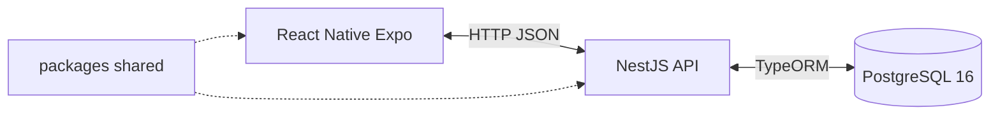
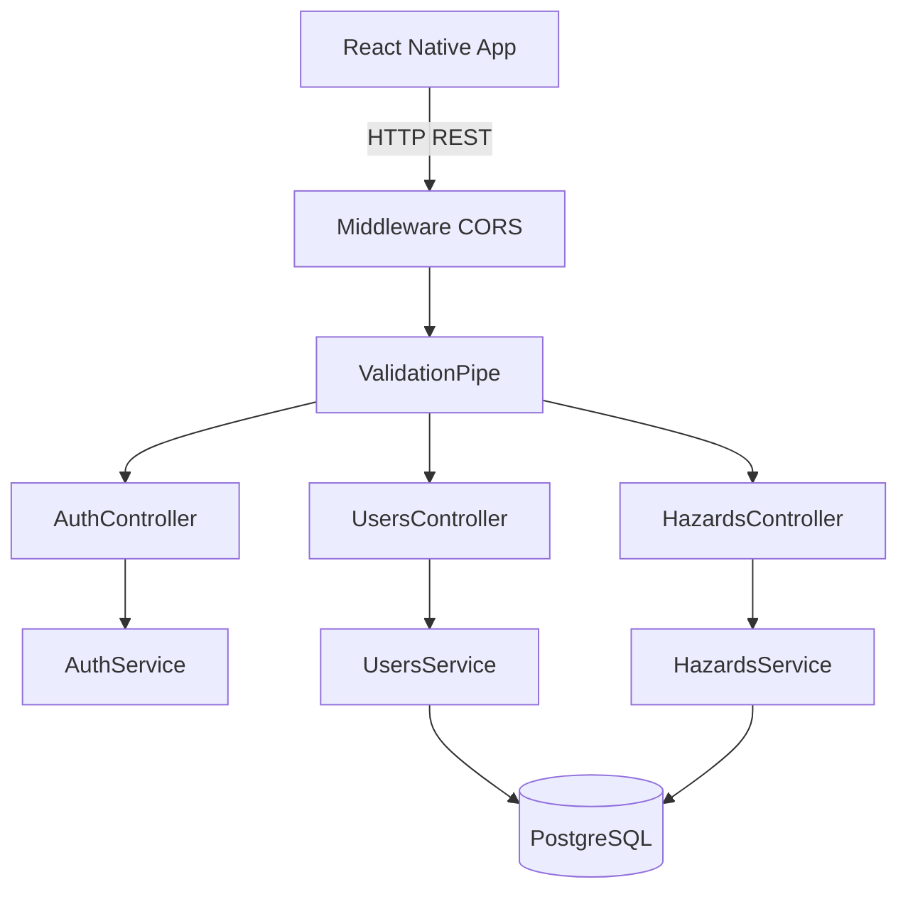
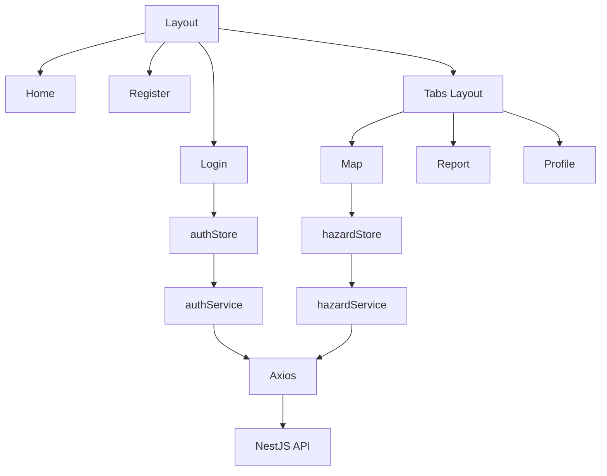
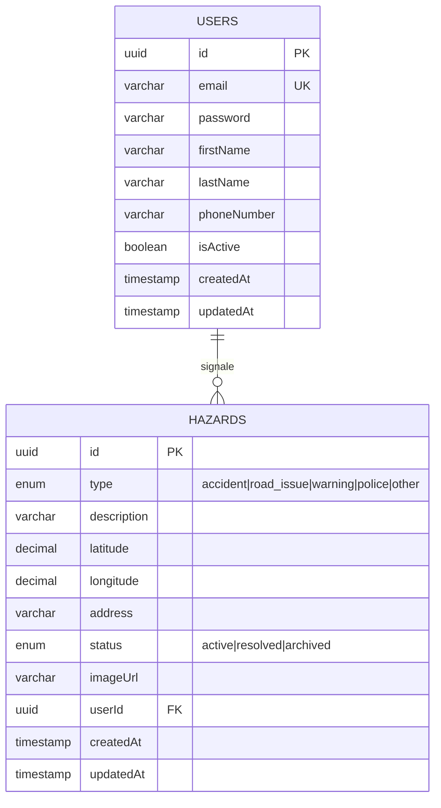
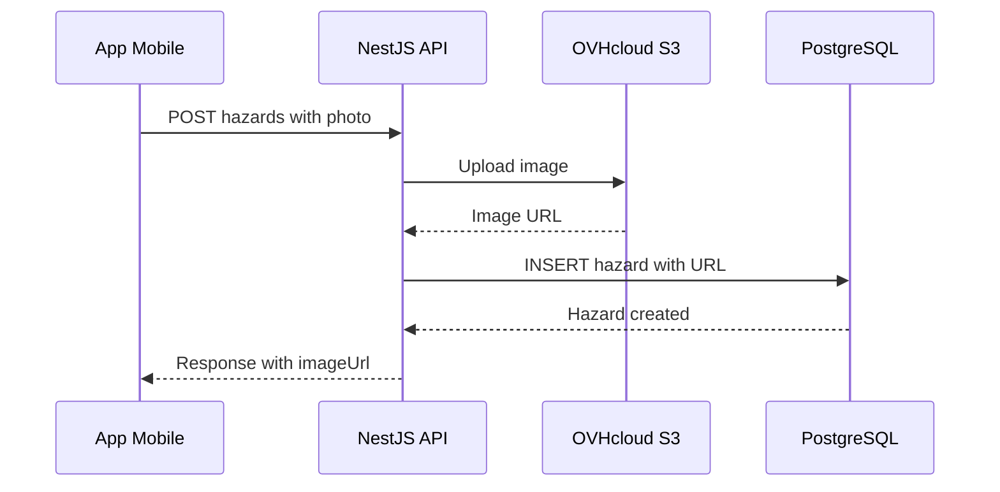
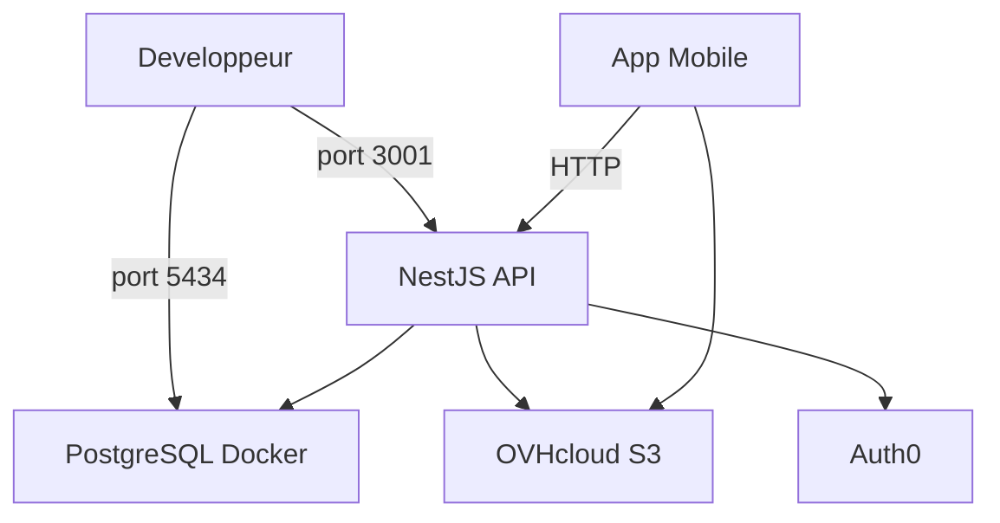
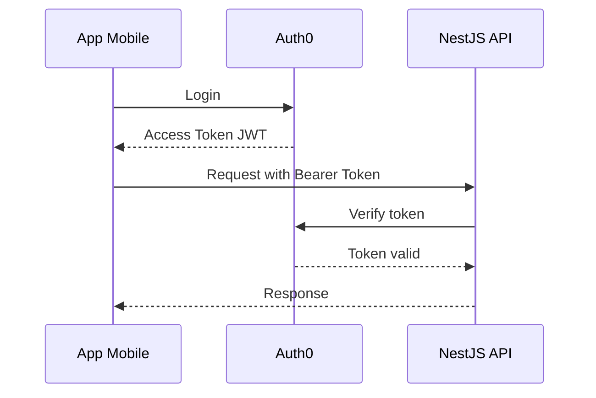
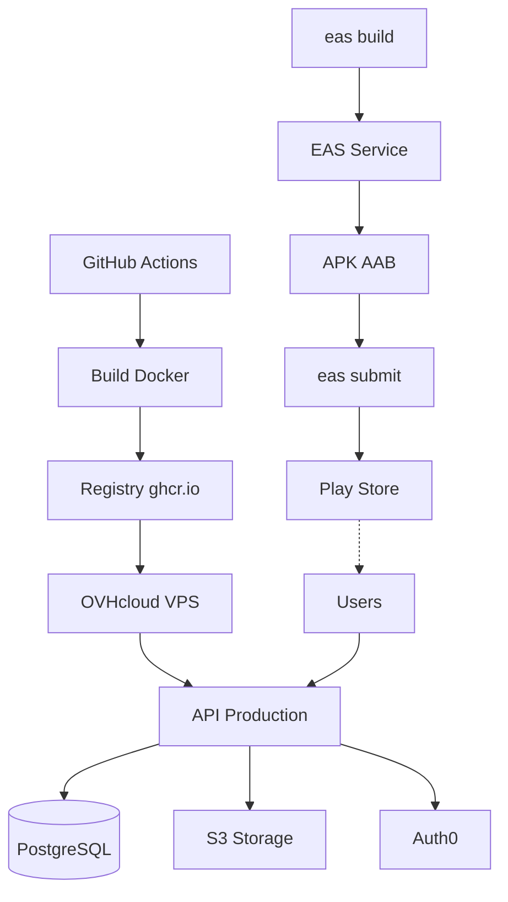
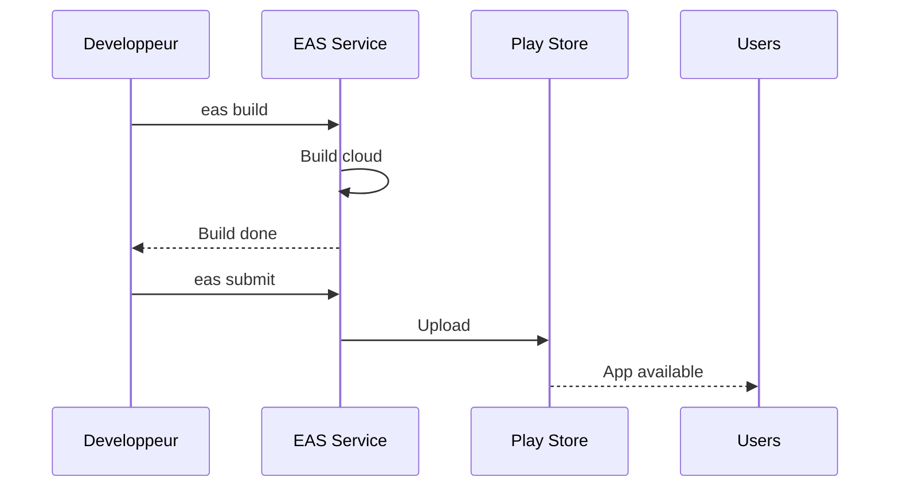

# Document d'Architecture Logicielle (DAL)

**Projet :** Citizen Alert
**Version :** 1.0
**Date :** 05/02/2026
**Equipe :** BREVET Noa | BUCHY -- PETARD Kenzo | TRAN Florian
**Ecole :** ESGI -- Master 2

> **Document complementaire :** [Methodologie de developpement](./METHODOLOGIE.md) -- decrit le cycle de developpement, les outils, la CI/CD et les processus qualite.

---

## Table des matieres

1. [Objet du document](#1-objet-du-document)
2. [Choix de la stack technique](#2-choix-de-la-stack-technique)
3. [Architecture logicielle](#3-architecture-logicielle)
4. [Infrastructure et conteneurisation](#4-infrastructure-et-conteneurisation)
5. [Securite](#5-securite)
6. [Environnements](#6-environnements)

---

## 1. Objet du document

Ce document decrit l'**architecture logicielle** de **Citizen Alert**, application mobile de signalement d'incidents sur la voirie. Il couvre les choix techniques, l'organisation du code, le modele de donnees, l'infrastructure et la securite.

Il s'appuie sur le cahier des charges et l'analyse fonctionnelle du besoin (AFB) pour garantir la coherence entre les exigences fonctionnelles et les decisions d'architecture.

**Problematique :** Comment simplifier et centraliser le signalement, la gestion et le suivi des incidents sur voirie, tout en repondant aux besoins varies des citoyens, des agents de terrain et des collectivites ?

**Perimetre MVP :**
- Carte interactive des signalements
- Formulaire de creation (nom, lieu, photo)
- Traitement du signalement (statut, suivi)

---

## 2. Choix de la stack technique

### 2.1 Vue d'ensemble



### 2.2 Justification des choix

| Composant | Technologie | Justification |
|-----------|------------|---------------|
| **Langage** | TypeScript | Typage statique partage front/back, reduction des bugs, autocompletion |
| **Backend** | NestJS 11 | Framework structure (modules, DI, guards), ecosysteme mature, conventions claires |
| **ORM** | TypeORM | Integration native NestJS, support PostgreSQL, decorateurs TypeScript |
| **BDD** | PostgreSQL 16 | Robuste, open-source, support geospatial natif, adapte aux donnees structurees |
| **Auth** | Auth0 (fournisseur externe) | Authentification deleguee, conforme RGPD, gestion des tokens OAuth2/OIDC, SSO, MFA integre, pas de stockage de mots de passe cote serveur |
| **Mobile** | React Native + Expo | Cross-platform iOS/Android, hot reload, acces natif (camera, GPS), Expo simplifie le build |
| **Routing mobile** | Expo Router | File-based routing, convention Next.js, navigation typee |
| **State management** | Zustand | Leger, simple, pas de boilerplate (vs Redux), performant |
| **HTTP Client** | Axios | Intercepteurs, gestion d'erreurs, timeout configurable |
| **Monorepo** | pnpm workspaces | Partage de types, un seul lockfile, installation rapide, espace disque optimise |
| **Conteneurisation** | Docker + Compose | Environnement reproductible, isolation, deploiement simplifie |
| **Stockage objets** | OVHcloud Object Storage (S3) | Stockage des photos de signalements, API compatible S3, scalable, pas de fichiers sur le serveur applicatif |
| **Hebergement** | OVHcloud | Hebergeur europeen (conformite RGPD), deploiement d'images Docker, souverainete des donnees |
| **Automatisation** | Makefile | Point d'entree unique, commandes memorisables, pas de dependance supplementaire |
| **CI/CD** | GitHub Actions | Integre a GitHub, gratuit pour les repos publics, configuration YAML declarative |
| **Registry Docker** | GitHub Container Registry (ghcr.io) | Hebergement d'images Docker, integre a GitHub, gratuit pour repos publics |
| **Deploiement mobile** | Expo Application Services (EAS) | Build et submit automatises vers Google Play Store et App Store |
| **Qualite** | ESLint + Prettier | Lint automatique, formatage uniforme |

### 2.3 Versions principales

| Dependance | Version |
|-----------|---------|
| Node.js | >= 18.0.0 |
| pnpm | >= 8.0.0 |
| TypeScript | 5.9.3 |
| NestJS | 11.x |
| TypeORM | 0.3.28 |
| PostgreSQL | 16 (Alpine) |
| React Native | 0.81.x |
| Expo SDK | 54.x |
| Expo Router | 6.x |
| Zustand | 5.x |

---

## 3. Architecture logicielle

### 3.1 Architecture Monorepo

```
citizen-alert/
|-- apps/
|   |-- api/                  # Backend NestJS
|   |   |-- src/
|   |   |   |-- auth/         # Module authentification
|   |   |   |-- users/        # Module utilisateurs
|   |   |   |-- hazards/      # Module signalements
|   |   |   |-- app.module.ts # Module racine
|   |   |   +-- main.ts       # Point d'entree
|   |   |-- test/             # Tests E2E
|   |   +-- Dockerfile
|   +-- mobile/               # Frontend React Native
|       |-- app/              # Ecrans (file-based routing)
|       |   |-- auth/         # Login, Register
|       |   +-- (tabs)/       # Navigation par onglets
|       +-- src/
|           |-- services/     # Couche API (Axios)
|           |-- stores/       # Etat global (Zustand)
|           |-- components/   # Composants reutilisables
|           |-- hooks/        # Hooks personnalises
|           +-- types/        # Types locaux
|-- packages/
|   +-- shared/               # Types partages front/back
|       +-- src/types/
|-- docker/                   # Docker Compose + init SQL
|-- scripts/                  # Scripts utilitaires
|-- Makefile                  # Commandes automatisees
+-- package.json              # Racine monorepo
```

### 3.2 Architecture Backend (NestJS -- Architecture modulaire)



**Pattern architectural :** Chaque module suit le pattern **Controller -> Service -> Entity/Repository** :
- **Controller** : Point d'entree HTTP, validation des DTOs, delegation au Service
- **Service** : Logique metier, interactions avec le Repository
- **Entity** : Mapping objet-relationnel (TypeORM), schema de la table

### 3.3 Architecture Frontend (React Native + Expo)



**Flux de donnees unidirectionnel :**
1. L'ecran appelle une action du **Store** (Zustand)
2. Le Store appelle le **Service** (couche API)
3. Le Service effectue la requete HTTP via **Axios**
4. La reponse met a jour le **State** du Store
5. Le composant se **re-render** automatiquement

### 3.4 Modele de donnees



### 3.5 Stockage des images (OVHcloud Object Storage -- S3)

Les photos jointes aux signalements sont stockees dans un **bucket S3** heberge sur OVHcloud Object Storage (API compatible Amazon S3). Ce choix decouple le stockage de fichiers du serveur applicatif et de la base de donnees.

#### Pourquoi un stockage objet S3 et pas la BDD ?

| Critere | PostgreSQL (BLOB) | Stockage objet S3 |
|---------|-------------------|-------------------|
| **Performance** | Degrade les requetes, surcharge le WAL | Acces direct par URL, pas d'impact sur la BDD |
| **Scalabilite** | Limitee par la taille de la BDD | Stockage quasi-illimite, facturation a l'usage |
| **Couts** | Stockage BDD couteux, sauvegardes lourdes | Stockage basse densite, tres economique |
| **CDN / Cache** | Impossible | Compatible CDN pour servir les images rapidement |
| **Sauvegardes** | Photos incluses = sauvegardes lentes | Sauvegardes BDD legeres, images gerees separement |

#### Architecture du flux d'upload



**Configuration du bucket :**
- Fournisseur : OVHcloud Object Storage (S3-compatible)
- Region : GRA (Gravelines, France)
- Acces : Public en lecture, prive en ecriture
- SDK : `@aws-sdk/client-s3`

> En base de donnees, seule l'URL de l'image est stockee, pas le fichier binaire.

Les variables d'environnement S3 configurent l'endpoint OVHcloud, la region (Gravelines), le nom du bucket et les credentials d'acces.

---

### 3.6 Endpoints API REST

| Methode | Route | Auth | Description |
|---------|-------|------|-------------|
| `POST` | `/api/auth/register` | Non | Inscription |
| `POST` | `/api/auth/login` | Non | Connexion |
| `GET` | `/api/auth/profile` | JWT | Profil connecte |
| `GET` | `/api/users` | JWT | Liste des utilisateurs |
| `GET` | `/api/users/:id` | JWT | Detail utilisateur |
| `PATCH` | `/api/users/:id` | JWT | Modifier utilisateur (self) |
| `DELETE` | `/api/users/:id` | JWT | Supprimer utilisateur (self) |
| `POST` | `/api/hazards` | JWT | Creer un signalement |
| `GET` | `/api/hazards` | Non | Liste des signalements |
| `GET` | `/api/hazards/active` | Non | Signalements actifs |
| `GET` | `/api/hazards/nearby` | Non | Signalements a proximite |
| `GET` | `/api/hazards/:id` | Non | Detail d'un signalement |
| `PATCH` | `/api/hazards/:id` | JWT | Modifier (proprietaire) |
| `DELETE` | `/api/hazards/:id` | JWT | Supprimer (proprietaire) |

---

## 4. Infrastructure et conteneurisation

### 4.1 Architecture Docker



### 4.2 Dockerfile (Multi-stage build)

Le Dockerfile de l'API utilise un **build multi-stage** pour optimiser la taille de l'image finale :

| Stage | Image de base | Role |
|-------|--------------|------|
| **builder** | `node:18-slim` | Installe les deps, compile TypeScript |
| **production** | `node:18-slim` | Deps de production uniquement + artefacts compiles |

Cela permet de ne pas embarquer les outils de build (TypeScript, ESLint, etc.) dans l'image finale.

### 4.3 Docker Compose -- Services

| Service | Image | Port externe | Port interne | Healthcheck |
|---------|-------|-------------|-------------|-------------|
| `postgres` | `postgres:16-alpine` | 5434 | 5432 | `pg_isready` |
| `api` | Build local (Dockerfile) | 3002 | 3000 | -- |

**Reseau :** `citizen-alert-network` (bridge) -- permet la communication inter-conteneurs par nom de service (ex: `postgres:5432`).

**Volume :** `postgres_data` -- persistance des donnees entre redemarrages.

---

## 5. Securite

### 5.1 Authentification deleguee (Auth0)

L'authentification est deleguee a **Auth0**, fournisseur d'identite externe (IDaaS). Ce choix permet de :

- **Ne pas stocker de mots de passe** cote serveur : la gestion des credentials est entierement geree par Auth0
- **Beneficier de fonctionnalites avancees** sans developpement : MFA (multi-factor authentication), SSO (single sign-on), social login (Google, Apple)
- **Respecter la conformite RGPD** : Auth0 propose des options d'hebergement EU et des politiques de retention de donnees configurables
- **Securiser les echanges** via les standards OAuth 2.0 et OpenID Connect (OIDC)



Le backend valide les tokens JWT emis par Auth0 via la cle publique (JWKS endpoint), sans jamais avoir acces aux credentials utilisateur.

### 5.2 Autres mesures de securite

| Mesure | Implementation |
|--------|---------------|
| **Validation des entrees** | class-validator (DTOs avec decorateurs) |
| **Whitelist des champs** | `forbidNonWhitelisted: true` sur le ValidationPipe global |
| **CORS** | Origines autorisees configurables (`ALLOWED_ORIGINS`) |
| **Protection des routes** | Guards NestJS (`JwtAuthGuard`) |
| **Autorisation** | Verification proprietaire sur les operations sensibles (update/delete) |

### 5.3 Variables sensibles

Les secrets (`AUTH0_DOMAIN`, `AUTH0_CLIENT_ID`, `DB_PASSWORD`) sont geres via des variables d'environnement (`.env` local, secrets GitHub Actions en CI). Le fichier `.env` est exclu du depot Git (`.gitignore`).

---

## 6. Environnements

### 6.1 Hebergement de production (OVHcloud + Google Play Store)

L'application est hebergee sur **OVHcloud** pour le backend, et distribuee sur **Google Play Store** pour l'application mobile. Ce choix repond a plusieurs exigences :

**Backend (OVHcloud) :**
- **Conformite RGPD** : donnees hebergees en France/UE, pas de transfert hors UE
- **Souverainete** : fournisseur francais, soumis au droit europeen
- **Deploiement Docker natif** : les images Docker construites en CI sont directement deployees sur l'infrastructure OVHcloud
- **Cout maitrise** : offres adaptees aux projets universitaires et startups

**Mobile (Expo + Google Play Store) :**
- **Expo Application Services (EAS)** : service de build et submit automatise pour React Native
- **Distribution** : publication sur Google Play Store (Android) et App Store (iOS)
- **OTA Updates** : mises a jour JavaScript sans rebuild via Expo Updates

**Strategie de deploiement complete :**



**Flux de deploiement :**

1. **Backend** : Merge vers `main` → CI/CD → Build image → Push vers ghcr.io → Deploy OVHcloud
2. **Mobile** : `eas build` → Build cloud → `eas submit` → Publication Play Store
3. **Communication** : App mobile (Play Store) ↔ HTTPS ↔ API (OVHcloud)

### 6.2 Tableau des environnements

| Environnement | Backend | Base de donnees | Mobile | Usage |
|--------------|---------|----------------|--------|-------|
| **Dev local** | Machine developpeur (:3001) | PostgreSQL Docker (:5434) | Expo Go (dev) | Developpement quotidien |
| **Dev Docker** | Machine developpeur (:3002) | PostgreSQL Docker (:5434) | Expo Go (dev) | Test de l'image Docker |
| **CI** | GitHub Actions (Ubuntu) | PostgreSQL service (:5432) | -- | Tests automatises |
| **Production** | OVHcloud (https://api.citizenalert.fr) | PostgreSQL OVHcloud | Google Play Store | Deploiement final |

### 6.3 Variables d'environnement

Les variables d'environnement sont gerees par contexte (dev, CI, production) et couvrent :

**Backend :**
- Configuration base de donnees (host, port, credentials)
- Auth0 (domain, client ID, secrets)
- OVHcloud S3 (endpoint, bucket, access keys)
- CORS et origines autorisees

**Mobile :**
- URL de l'API (localhost en dev, https://api.citizenalert.fr en prod)
- Configuration Auth0
- Variables exposees via `EXPO_PUBLIC_*`

> **Note :** Les secrets de production sont stockes dans GitHub Secrets (backend) et EAS Secrets (mobile), jamais commites dans le code.

---

### 6.4 Deploiement mobile avec Expo Application Services (EAS)

**Expo Application Services (EAS)** est la plateforme de build et deploiement cloud pour les applications React Native/Expo. Elle permet de construire et publier l'application sur les stores sans configuration locale complexe.

#### Workflow de deploiement mobile



#### Processus de deploiement

1. **Build** : `eas build --platform android --profile production` genere l'APK/AAB en cloud
2. **Submit** : `eas submit --platform android` upload automatiquement vers le Play Store
3. **OTA Updates** : `eas update` permet des mises a jour JavaScript sans rebuild complet

#### Avantages

- Build cloud (pas besoin d'Android Studio local)
- Submit automatise vers les stores
- Gestion des certificats de signature
- Mises a jour OTA pour corrections rapides

> **Note :** Compte developpeur Google Play requis (25$ one-time fee).
