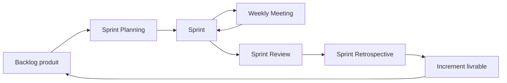
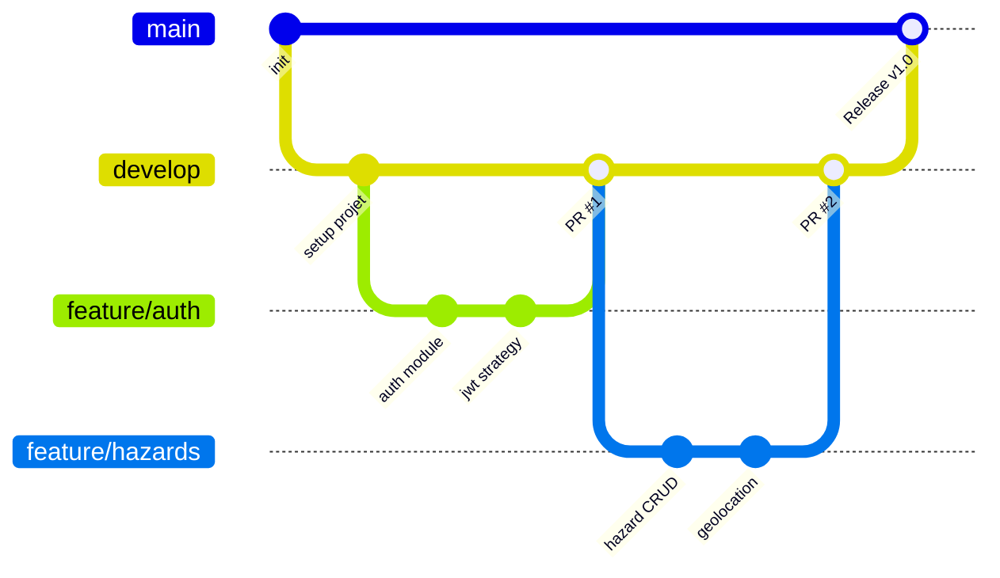
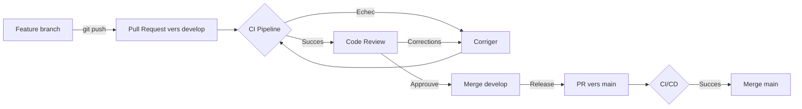
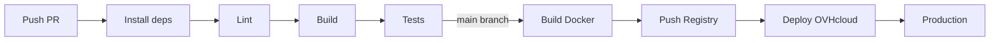
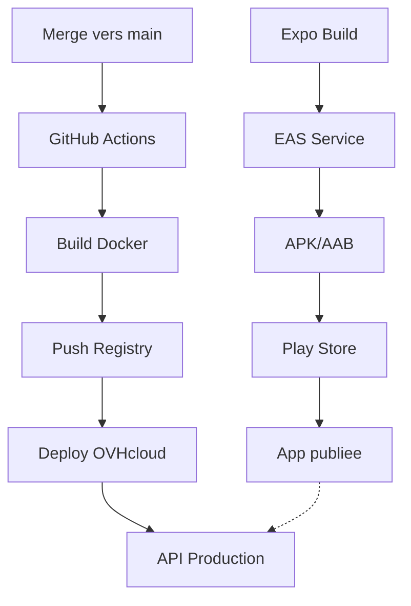
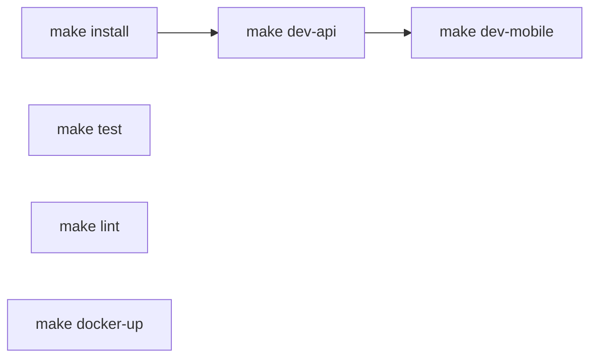
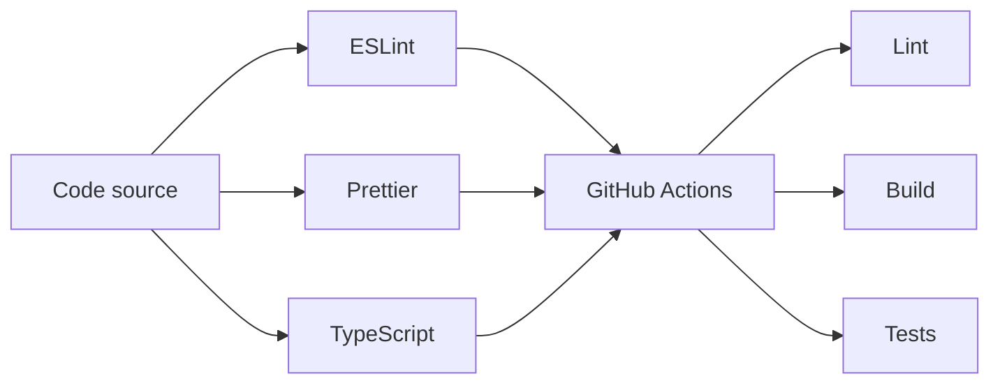
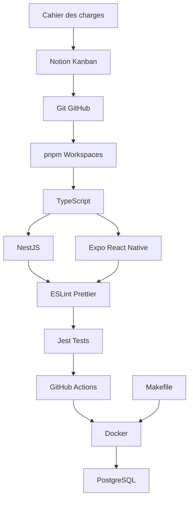

# Document de Methodologie de Developpement

**Projet :** Citizen Alert
**Version :** 1.0
**Date :** 05/02/2026
**Equipe :** BREVET Noa | BUCHY -- PETARD Kenzo | TRAN Florian
**Ecole :** ESGI -- Master 2

> **Document complementaire :** [Document d'Architecture Logicielle (DAL)](./DAL.md) -- decrit la stack, l'architecture, le modele de donnees et l'infrastructure.

---

## Table des matieres

1. [Objet du document](#1-objet-du-document)
2. [Cycle de developpement](#2-cycle-de-developpement)
3. [Detail des outils et methodologies](#3-detail-des-outils-et-methodologies)
4. [Gestion du code source](#4-gestion-du-code-source)
5. [Integration et deploiement continus (CI/CD)](#5-integration-et-deploiement-continus-cicd)
6. [Automatisation (Makefile)](#6-automatisation-makefile)
7. [Qualite de code](#7-qualite-de-code)
8. [Annexe -- Chaine d'outils](#annexe----chaine-doutils)

---

## 1. Objet du document

Ce document decrit la **methodologie de developpement** adoptee pour le projet **Citizen Alert**. Il presente le cycle de developpement, justifie chaque outil et processus utilise, et detaille les pipelines CI/CD, l'automatisation et les pratiques de qualite de code.

L'objectif est de formaliser **comment** l'equipe developpe, teste et livre le logiciel, en complement du [DAL](./DAL.md) qui decrit **quoi** est construit (architecture, modele de donnees, infrastructure).

---

## 2. Cycle de developpement

### 2.1 Methodologie Agile -- Scrum

Le projet suit une **methodologie Agile** avec des sprints iteratifs. Le developpement est organise en cycles courts permettant des livraisons incrementales et une adaptation continue aux besoins.

**Cycle de sprint :**



### 2.2 Organisation des sprints

**Sprint 1 : Setup & Auth**
- Configuration monorepo, Docker, CI/CD
- Module authentification (Auth0)
- Ecrans login/register mobile

**Sprint 2 : Signalements**
- CRUD signalements (API + mobile)
- Upload photos (S3)
- Carte interactive

**Sprint 3 : Finalisation**
- Tests, corrections bugs
- Deploiement production (OVHcloud + Play Store)
- Documentation

### 2.3 Outils et processus par etape

Le tableau suivant presente les outils utilises a chaque etape du developpement, organises pour illustrer la couverture complete du cycle (de l'expression du besoin au deploiement) :

| Etape | Domaine | Outil | Objectif |
|-------|---------|-------|----------|
| 1 | Expression du besoin | Cahier des charges, AFB | Definition du perimetre et des exigences |
| 2 | Gestion de projet | Notion (Kanban) | Suivi des sprints et des taches |
| 3 | Versionnement | Git + GitHub | Collaboration et historique du code |
| 4 | Developpement | TypeScript, NestJS, Expo | Implementation des fonctionnalites |
| 5 | Gestion des deps | pnpm workspaces | Monorepo et partage de types |
| 6 | Qualite de code | ESLint + Prettier | Uniformite et bonnes pratiques |
| 7 | Tests | Jest | Non-regression et fiabilite |
| 8 | Integration continue | GitHub Actions | Validation automatique |
| 9 | Deploiement | Docker, EAS, OVHcloud | Mise en production |

---

## 3. Detail des outils et methodologies

### Etape 1 -- Expression du besoin (Cahier des charges + AFB)

**Outil :** Documents de cadrage (Cahier des charges, Analyse Fonctionnelle du Besoin)

**Pourquoi :** Avant toute ligne de code, les besoins fonctionnels et non fonctionnels sont formalises. Le cahier des charges fixe le perimetre, les contraintes et les criteres de succes. L'AFB identifie les acteurs (citoyens, services techniques, elus), les fonctions de service et les flux d'information. Cette etape sert de **reference contractuelle** tout au long du projet et permet de valider chaque livrable par rapport aux exigences initiales.

**Apport au projet :** Evite le hors-sujet, aligne toute l'equipe sur un objectif commun, sert de grille de validation finale.

---

### Etape 2 -- Gestion de projet (Notion -- Kanban)

**Outil :** Notion -- tableaux Kanban

**Pourquoi :** Notion centralise la gestion de projet dans un espace unique et collaboratif. Le tableau Kanban decoupe le backlog en taches atomiques et offre une visibilite en temps reel sur l'avancement (colonnes : A faire, En cours, En review, Termine). Chaque tache est assignee, datee et liee a une branche Git.

**Apport au projet :**
- **Visibilite** : chaque membre voit instantanement l'etat du projet
- **Priorisation** : les taches sont ordonnees par priorite dans le backlog
- **Tracabilite** : lien entre tache Notion, branche Git et Pull Request
- **Rituels Agile** : sprint planning, suivi hebdomadaire, retrospective

---

### Etape 3 -- Versionnement (Git + GitHub)

**Outil :** Git (systeme de controle de version distribue) + GitHub (plateforme d'hebergement)

**Pourquoi :** Git permet le **developpement parallele** grace au branching : chaque fonctionnalite est developpee dans une branche isolee (`feature/xxx`), sans impacter le travail des autres. Le systeme **decentralise** garantit que chaque developpeur possede une copie complete de l'historique, assurant la resilience et le travail hors-ligne. GitHub ajoute les Pull Requests (revue de code entre pairs), la gestion des issues et le declenchement des pipelines CI/CD.

**Apport au projet :**
- **Developpement parallele** : 3 developpeurs travaillent simultanement sur des branches separees
- **Historique complet** : chaque modification est tracee (qui, quand, pourquoi)
- **Revue de code** : les Pull Requests imposent une relecture avant merge
- **Rollback** : possibilite de revenir a n'importe quel etat anterieur du code
- **Integration CI/CD** : chaque push declenche automatiquement les pipelines de validation

> Le detail de la strategie de branching et des conventions est traite dans la [section 4](#4-gestion-du-code-source).

---

### Etape 4 -- Developpement (TypeScript + NestJS + Expo)

**Outils :** TypeScript (langage), NestJS (backend), React Native + Expo (mobile)

**Pourquoi TypeScript :** Un langage unique cote front et back, avec un **typage statique strict**, reduit les bugs a la compilation plutot qu'au runtime. Le partage de types (package `shared`) garantit un contrat d'interface coherent entre l'API et l'application mobile. L'autocompletion et le refactoring sont fiabilises par le compilateur.

**Pourquoi NestJS :** Framework backend **structure et opinionate** : architecture modulaire (un module par domaine metier), injection de dependances native, decorateurs pour la validation, guards pour la securite. Ces conventions evitent les debats d'architecture et permettent a un nouveau developpeur de comprendre le code rapidement. L'ecosysteme NestJS (TypeORM, class-validator, integration Auth0) couvre tous les besoins du projet sans integration artisanale. L'authentification est deleguee a **Auth0** (fournisseur d'identite externe), ce qui evite de gerer les mots de passe cote serveur et apporte gratuitement le MFA, le SSO et la conformite RGPD (voir [DAL -- section 5](./DAL.md#5-securite)).

**Pourquoi React Native + Expo :** Un seul code source produit une application **native iOS et Android**, repondant a la contrainte du cahier des charges (compatibilite multi-plateforme). Expo simplifie l'acces aux API natives (camera, geolocalisation, notifications) et fournit un serveur de developpement avec hot-reload. Le file-based routing d'Expo Router suit les conventions modernes (inspirees de Next.js).

**Apport au projet :**
- **Productivite** : un seul langage, un seul ecosysteme, moins de context-switching
- **Fiabilite** : le typage statique detecte les erreurs avant l'execution
- **Maintenabilite** : architecture modulaire, conventions claires, code auto-documente
- **Cross-platform** : un seul code pour iOS et Android

> L'architecture detaillee (modules, patterns, diagrammes) est documentee dans le [DAL -- section 3](./DAL.md#3-architecture-logicielle).

---

### Etape 5 -- Gestion des dependances (pnpm workspaces -- Monorepo)

**Outil :** pnpm avec workspaces

**Pourquoi :** Le monorepo regroupe le backend (`apps/api`), le mobile (`apps/mobile`) et les types partages (`packages/shared`) dans un **depot unique**. pnpm optimise l'espace disque via un store global de packages (liens symboliques au lieu de copies) et garantit un **lockfile unique** (`pnpm-lock.yaml`) pour tout le projet. Les workspaces permettent d'executer des commandes ciblees (`pnpm --filter api build`) tout en partageant les dependances communes.

**Apport au projet :**
- **Coherence** : une seule source de verite pour les types partages front/back
- **Simplicite** : un seul `git clone`, un seul `make install` pour tout configurer
- **Performance** : installation des deps plus rapide que npm/yarn grace au content-addressable store
- **Orchestration** : `pnpm -r` execute des commandes sur tous les packages, `--filter` cible un package precis

---

### Etape 6 -- Qualite de code (ESLint + Prettier)

**Outils :** ESLint (analyse statique), Prettier (formatage automatique)

**Pourquoi ESLint :** Analyse statique du code TypeScript pour detecter les erreurs courantes (variables non utilisees, `any` implicite, imports manquants) **avant meme l'execution**. Les regles configurees dans `.eslintrc.js` imposent des bonnes pratiques communes a toute l'equipe. Integre avec Prettier pour eviter les conflits entre formatage et linting.

**Pourquoi Prettier :** Formatage automatique et **deterministe** du code (indentation, quotes, virgules, largeur de ligne). Elimine definitivement les debats de style dans les Pull Requests. Un seul fichier `.prettierrc` assure un code visuellement uniforme sur tout le projet.

**Apport au projet :**
- **Uniformite** : chaque fichier suit les memes regles, quel que soit l'auteur
- **Prevention** : les erreurs sont detectees a l'ecriture, pas en production
- **Productivite** : zero temps perdu sur le formatage, l'outil s'en charge

> La configuration detaillee est documentee dans la [section 7](#7-qualite-de-code).

---

### Etape 7 -- Tests (Jest + Supertest)

**Outils :** Jest (framework de test), ts-jest (support TypeScript), @nestjs/testing (tests d'integration NestJS)

**Pourquoi :** Les tests automatises verifient que le code **fonctionne conformement aux specifications** a chaque modification. Les tests unitaires valident la logique metier isolee (services). Les tests d'integration verifient le bon cablage des modules NestJS (controllers + services + base de donnees).

**Apport au projet :**
- **Non-regression** : chaque modification est verifiee contre les tests existants
- **Confiance** : le refactoring est securise par le filet de tests
- **Documentation vivante** : les tests decrivent le comportement attendu du systeme
- **Detection precoce** : un bug est detecte localement, pas en production

| Type | Outil | Portee | Exemple |
|------|-------|--------|---------|
| Unitaire | Jest + ts-jest | Logique metier isolee | `AuthService.validateUser()` |
| Integration | @nestjs/testing | Module complet | `HazardsModule` avec DB test |

> **Note :** Les tests E2E (End-to-End) ne sont pas implementes dans ce projet par contrainte de temps, mais la CI garantit que les tests unitaires et d'integration passent avant chaque merge.

---

### Etape 8 -- Integration continue (GitHub Actions)

**Outil :** GitHub Actions (pipelines CI/CD)

**Pourquoi :** A chaque push ou Pull Request, GitHub Actions execute automatiquement un pipeline de validation dans un **environnement vierge et reproductible** (Ubuntu + PostgreSQL de test). Le pipeline enchaine : installation des deps, lint, build, tests. Si une etape echoue, la Pull Request est **bloquee** et ne peut pas etre mergee. Cela garantit que la branche `main` contient toujours du code fonctionnel et valide.

**Apport au projet :**
- **Automatisation** : aucune validation manuelle necessaire, le pipeline s'execute a chaque push
- **Reproductibilite** : l'environnement CI est identique pour tous, eliminant le "ca marche sur ma machine"
- **Protection de main** : seul le code qui passe tous les checks peut etre merge
- **Feedback rapide** : le developpeur est notifie en minutes si son code casse quelque chose
- **Gratuit** : GitHub Actions est gratuit pour les repos publics/educatifs

> Le detail du pipeline et du workflow YAML est traite dans la [section 5](#5-integration-et-deploiement-continus-cicd).

---

### Etape 9 -- Conteneurisation et deploiement (Docker + Makefile)

**Outils :** Docker + Docker Compose (conteneurisation), Makefile (automatisation des commandes)

**Pourquoi Docker :** Docker encapsule chaque service (API, PostgreSQL) dans un **conteneur isole et reproductible**. Le `Dockerfile` multi-stage produit une image de production legere (sans outils de dev). Docker Compose orchestre les conteneurs (reseau interne, volumes persistants, healthchecks, ordre de demarrage). Tout developpeur obtient un environnement identique avec un seul `make docker-up`, quel que soit son OS. En production, l'image Docker est poussee vers un **registry** (GitHub Container Registry ou Docker Hub), puis deployee sur **OVHcloud** (hebergeur europeen, conformite RGPD, souverainete des donnees). L'application mobile, distribuee sur le **Google Play Store** via **Expo Application Services (EAS)**, communique avec cette API backend via HTTPS.

**Pourquoi Makefile :** Le Makefile sert de **point d'entree unique** et de couche d'abstraction au-dessus de pnpm et Docker. Au lieu de memoriser `docker compose -f docker/docker-compose.yml up -d postgres && pnpm --filter api start:dev`, le developpeur tape `make dev-api`. Cela reduit la courbe d'apprentissage, uniformise les commandes et documente les operations courantes.

**Apport au projet :**
- **"Works on my machine" elimine** : Docker garantit le meme environnement partout (dev, CI, prod)
- **Isolation** : chaque service a ses propres dependances, pas de conflit systeme
- **Demarrage en une commande** : `make dev-api` lance la DB + l'API, `make dev-mobile` lance le front
- **Production-ready** : l'image Docker multi-stage est directement deployable
- **Onboarding simplifie** : un nouveau developpeur est operationnel en 3 commandes (`git clone`, `make install`, `make dev-api`)

> L'architecture Docker detaillee (Dockerfile, Compose, ports, volumes) est documentee dans le [DAL -- section 4](./DAL.md#4-infrastructure-et-conteneurisation).

---

## 4. Gestion du code source

### 4.1 Strategie de branching (Git Flow simplifie)



- **`main`** : branche de production, deployee sur Google Play Store
- **`develop`** : branche d'integration, recoit les merges des features
- **`feature/*`** : branches de travail, une par fonctionnalite

**Workflow :**
1. Creer une branche `feature/*` depuis `develop`
2. Developper et commiter
3. Ouvrir une Pull Request vers `develop` (declenche CI : lint + tests)
4. Apres validation, merger dans `develop`
5. Periodiquement, merger `develop` dans `main` pour une release (declenche CD : build Docker image)

### 4.2 Convention de nommage des branches

| Prefixe | Usage | Exemple |
|---------|-------|---------|
| `feature/` | Nouvelle fonctionnalite | `feature/hazard-map` |
| `fix/` | Correction de bug | `fix/login-validation` |
| `refactor/` | Refactoring | `refactor/api-structure` |
| `docs/` | Documentation | `docs/dal` |

### 4.3 Convention de commits

Le projet suit la convention [Conventional Commits](https://www.conventionalcommits.org/), qui structure les messages de commit pour faciliter la lecture de l'historique et l'automatisation (changelogs, versionnement semantique) :

```
<type>: <description courte>

Types utilises :
  feat:     nouvelle fonctionnalite
  fix:      correction de bug
  docs:     documentation
  refactor: refactoring (pas de changement fonctionnel)
  test:     ajout ou modification de tests
  chore:    maintenance (deps, config, CI)
```

**Exemples :**
```
feat: add hazard creation endpoint
fix: resolve JWT expiration issue
docs: update DAL with CI/CD section
refactor: extract shared types to packages/shared
chore: update all packages to latest versions
```

### 4.4 Processus de Pull Request



Regles :
- **PR vers `develop`** : CI execute lint + tests automatiquement
- **PR vers `main`** : CI/CD execute lint + tests + build de l'image Docker de production
- Au moins 1 approbation requise avant merge
- Le titre de la PR suit la convention Conventional Commits
- Les branches sont supprimees apres merge

---

## 5. Integration et deploiement continus (CI/CD)

### 5.1 Pipeline CI/CD cible



### 5.2 GitHub Actions -- Workflow CI/CD

Le projet utilise deux workflows :

#### Workflow CI (Pull Requests vers `develop`)

S'execute a chaque creation de branche et Pull Request vers `develop`. Valide le code et lance les tests.

**Etapes :**
1. Installation des dependances (pnpm)
2. Lint (ESLint + Prettier)
3. Build (TypeScript compilation)
4. Tests (Jest avec PostgreSQL de test)

#### Workflow CD (Merge vers `main`)

S'execute lors d'un merge vers `main`. Execute la CI complete, build l'image Docker de production et la pousse vers le registry pour deploiement sur OVHcloud.

**Etapes :**
1. CI complete (lint + build + tests)
2. Login au registry Docker (GitHub Container Registry)
3. Build de l'image Docker multi-stage
4. Tag de l'image (SHA du commit + latest)
5. Push vers ghcr.io
6. Deploiement sur OVHcloud (SSH ou API)

### 5.3 Strategie de deploiement

| Evenement | Action declenchee |
|-----------|-------------------|
| PR vers `develop` | CI : lint + build + tests |
| Merge vers `develop` | Rien (integration continue) |
| PR vers `main` | CI complet + review obligatoire (2 approbations) |
| Merge vers `main` | CD : lint + tests + build image Docker + push registry + deploy OVHcloud |

**Architecture de production :**
- **Backend API** : Deployee sur OVHcloud (VPS ou Kubernetes) via Docker
- **Registry Docker** : GitHub Container Registry (ghcr.io) ou Docker Hub
- **Base de donnees** : PostgreSQL hebergee sur OVHcloud
- **Stockage images** : OVHcloud Object Storage (S3-compatible)
- **Application mobile** : Distribuee sur Google Play Store (Android) via Expo Application Services (EAS)
- **Communication** : L'app mobile communique avec l'API OVHcloud via HTTPS (certificat SSL/TLS)

**Flux de deploiement complet :**



**Deploiement mobile (Expo) :**
- **Build** : `eas build --platform android --profile production`
- **Submit** : `eas submit --platform android` (upload automatique vers Play Store)
- **OTA Updates** : `eas update` pour les mises a jour JavaScript sans rebuild

> **Note :** Cette architecture (backend cloud + app mobile en store) est standard et recommandee. L'API OVHcloud expose des endpoints REST securises (Auth0 + JWT), accessibles depuis n'importe quelle app mobile publiee.

---

## 6. Automatisation (Makefile)

Le **Makefile** a la racine du projet sert de point d'entree unique pour toutes les commandes, evitant de memoriser les syntaxes pnpm/docker.

### 6.1 Commandes principales



### 6.2 Reference des commandes

| Commande | Description |
|----------|-------------|
| `make install` | Installer toutes les dependances |
| `make dev-api` | Demarrer DB (Docker) + API (local, port 3001) |
| `make dev-mobile` | Demarrer le serveur Expo |
| `make build` | Compiler l'API pour la production |
| `make test` | Lancer les tests |
| `make lint` | Verifier le code (ESLint) |
| `make format` | Formater le code (Prettier) |
| `make docker-up` | Demarrer tous les conteneurs Docker |
| `make docker-down` | Arreter les conteneurs |
| `make docker-rebuild` | Reconstruire les images Docker |
| `make db-shell` | Ouvrir un shell PostgreSQL |
| `make clean` | Supprimer node_modules et artefacts de build |

### 6.3 Workflow de developpement recommande

```
Terminal 1                    Terminal 2
+-----------------------+    +-----------------------+
| $ make dev-api        |    | $ make dev-mobile     |
|                       |    |                       |
| > PostgreSQL :5434    |    | > Expo Dev Server     |
| > NestJS API :3001    |    | > QR Code affiche     |
+-----------------------+    +-----------------------+
```

**Onboarding d'un nouveau developpeur :**
```bash
git clone <repo>          # 1. Cloner le depot
make install              # 2. Installer les dependances
make dev-api              # 3. Lancer le backend (Terminal 1)
make dev-mobile           # 4. Lancer le frontend (Terminal 2)
```

---

## 7. Qualite de code

### 7.1 Vue d'ensemble des barrieres de qualite



L'approche repose sur **2 barrieres successives** :

| Barriere | Moment | Outils | Ce qu'elle bloque |
|----------|--------|--------|-------------------|
| **1. IDE** | A l'ecriture | ESLint, Prettier, TypeScript | Erreurs de syntaxe, typage, formatage |
| **2. CI** | Au `git push` / PR | GitHub Actions | Code casse dans les branches partagees |

### 7.2 Configuration ESLint

Configuration TypeScript avec regles recommandees, integration Prettier pour eviter les conflits lint/format.

### 7.3 Configuration Prettier

Formatage automatique uniforme : semicolons, quotes simples, trailing commas, 100 caracteres max, 2 espaces d'indentation.

### 7.4 TypeScript strict mode

Mode strict active sur tout le projet pour detecter les erreurs de typage a la compilation (null checks, typage explicite, initialisation des proprietes).

---

## Annexe -- Chaine d'outils


